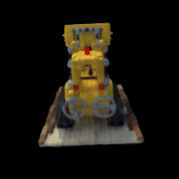

# Neural Radiance Fields (NeRF)

Implementation of a 3D Neural Radiance Field in PyTorch from scratch, covering 2D Neural Fields, 3D Camera Geometry Ray Casting, Ray Marching & Volume Rendering, and synthesizing Novel Views from a trained 8-Layer MLP.

  

## Repository Structure

This repository incrementally builds the components required for the 3D NeRF architecture.

### 1. 2D Neural Fields (`train_2d.ipynb`)
- Memorizes an ultra-high resolution 2D image using coordinate parameter mapping `f(x, y) = (r, g, b)`.
- Implements **High-Frequency Positional Encoding** with sinusoidal waves mapping 2D inputs to 42 parameters, fundamentally curing the MLP "spectral bias" issue and preventing smooth/blurry gradients.

### 2. Camera Geometry (`src/dataset_3d.py`)
- Mathematical generation of Origin arrays (`rays_o`) and Ray Direction mappings (`rays_d`).
- Parses the physical camera extrinsics (`c2w` transforms) and scalar intrinsics (`K` constants) into global bounding constraints.

### 3. Volume Rendering & Ray Marching (`src/rendering.py`)
- **`sample_along_rays`**: Slices arbitrary infinite rays into exactly 64 discrete coordinate nodes. Triggers randomized scalar jitter during training (`perturb=True`) forcing smooth un-coupled volume densities instead of memorizing fixed physical depths.
- **`volrend`**: Computes the numerical discrete proxy of original NeRF integration. Projects independent transparency densities (`sigma`) into localized physical occlusions to output one crisp final RGB pixel.

### 4. 3D NeRF Network Architecture (`src/model.py` & `train_3d.ipynb`)
- **The Architecture:** Fully view-dependent 8-Layer deep MLP.
- Computes location-exclusive physical Geometry (Density $\sigma$) entirely independent of viewport configurations. Later concatenates global directional orientation (`rays_d`) exclusively for localized reflective Color glares (RGB).
- Employs a dense Skip-Connection bypassing massive high-frequency coordinate loss at Layer 5.

### 5. Synthetic Arbitrary Orbit Generation (`src/vis_orbit.py`)
- Utilizes isolated mathematical `c2w` matrix rotations directly around the system origin independent of the 100 actual images to perfectly synthesize and hallucinate un-trained views of the model from dynamic 360-degrees.

--- 
**Developed for COMS4732W Computer Vision 2**
